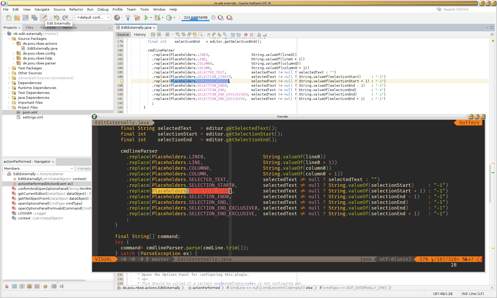
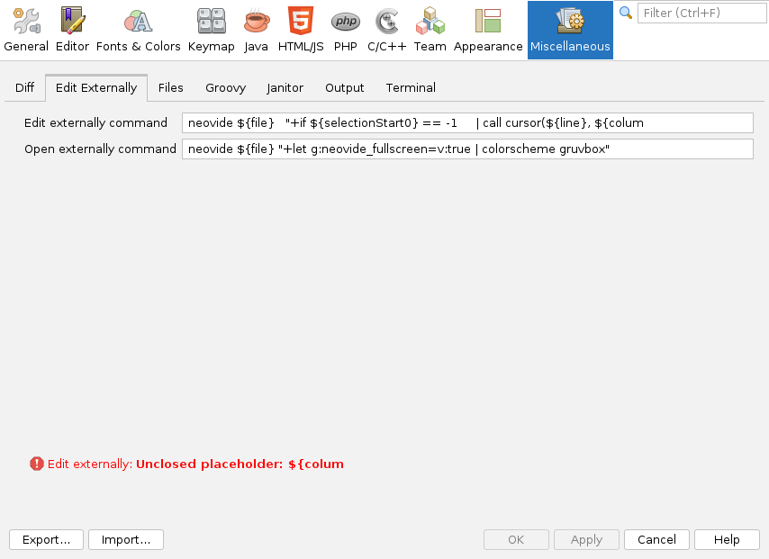

NetBeans Edit Externally
========================
Marco Herrn <marco@mherrn.de>
2019-08-22
:toc:
:homepage: https://github.com/hupfdule/nb-edit-externally
:download-page: https://github.com/hupfdule/nb-edit-externally/releases
:issue-tracker: https://github.com/hupfdule/nb-edit-externally/issues
:wiki: https://github.com/hupfdule/nb-edit-externally/wiki
:license-link: https://github.com/hupfdule/nb-edit-externally/blob/master/LICENSE.txt
:source-highlighter: prettify

NetBeans Edit Externally

Allows opening the currently edited file in an external editor.

About
-----

Its main purpose is to open the currently edited file at the exact same cursor
position as in NetBeans to execute some complex editing action that is not
easily possible within NetBeans itself.

The command to open the file in an external editor must be supplied by the
user and allows placeholders to specify the location of the cursor to be
able to jump to the same location of the cursor in NetBeans' editor.

A fallback command can be specified for opening a file for which no editor
window is open. This command doesn't support all the placeholders, but
allows editing a file directly from the Projects nodes.

Since version 2.0.0 this plugin also exposes values related to selected
text. This can be used to preselect the same text in the external editor if
that editor supports such a use case.

Usage
-----

This plugin adds an entry `Edit Externally` to the following menus:

 * Main Menu `Tools`
 * Context Menu of each editor window
 * Submenu `Tools` in the context popup menu of each node in the Projects view

Additionally an icon is placed in the `File` section of the main toolbar
and into the editor's toolbar:

Configuration
-------------

The configuration panel can be found at
`Tools / Options / Miscellaneous / Edit Externally`.

There are two commands to be configured:

 - Edit externally
 - Open externally

This plugin decides which one to call based on the information it has about
the currently selected file. If an open editor for the file is found, the
`Edit externally` action is called as it allows including cursor location
information in the command.

If no associated editor is found, the `Open externally` action is called
instead.

=== Placeholders

The following placeholders can be used for both commands:

[horizontal]
${file}::         The absolute path to the file.
${fileName}::     The file name of the file.
${fileBasename}:: The file name of the file without extension.
${fileExt}::      The file extension of the file.

These values always refer to the currently selected file in the editor
window or, when using the context menu entry in the navigation tree, the
file selected in the tree.

The following placeholders can additionally be used for the
`Edit externally` action:

[horizontal]
${line0}::                  The line of the cursor location (0-based).
${line}::                   The line of the cursor location (1-based).
${column0}::                The column of the cursor location (0-based).
${column}::                 The column of the cursor location (1-based).
${selectedText}::           The currently selected text or an empty string if no text is selected.
${selectionStart0}::        The location of the first character of a selection (number of chars in the file, 0-based) or -1 if no text is selected.
${selectionStart}::         The location of the first character of a selection (number of chars in the file, 1-based) or -1 if no text is selected.
${selectionEnd0}::          The location of the last character of a selection (number of chars in the file, 0-based) or -1 if no text is selected.
${selectionEnd}::           The location of the last character of a selection (number of chars in the file, 1-based) or -1 if no text is selected.
${selectionEndExclusive0}:: The location of the first character _after_ the selection (number of chars in the file, 0-based) or -1 if no text is selected.
${selectionEndExclusive}::  The location of the first character _after_ the selection (number of chars in the file, 1-based) or -1 if no text is selected.

All numeric values are provided in two different flavours, 0-based and
1-based. Use the one more appropriate for your use case. It makes the code
more readable than having to add or subtract 1 from its values.

The line and column placeholders are always filled (if there is an open
editor window for the corresponding file) as the cursor will always be on a
certain position in the file.\
All the remaining placeholders (related to text selection) are only filled
if there actually is selected text. If not, `${selectedText}` will be an
empty string; all the others will have the value -1.

The end of the selection is also available in an inclusive and an exclusive
form. The inclusive form specifies the cursor position of the last selected
character. For a single selected character it would be the same value as
the start of the selection. The exclusive form specifies the character
position _after_ the last selected character. For a single selected
character it would be the start of the selection + 1.

=== Quoting and Escaping

To allow command line arguments with spaces they can be enclosed within
single or double quotes. It is also possible to escape a single space or
quote character by preceding it with a backslash.

Backslashes take precedence over quotes. Therefore it is possible to have
quotes as part of a quoted string like in this example footnote:[In that
exact example it would be easier and more readable to instead alternate
single and double quotes: `myprogram 'my "quoted" string'`]:

----
myprogram 'my \'quoted\' string'
----

It is also possible to escape placeholders with a backslash to include them
literally and prevent them from being expanded:

----
myprogram literal \${file}
----

=== Examples

To call `vim` in an `urxvt` terminal the following configuration can be
used:

Edit externally:: `urxvt -e vim ${file} "+call cursor(${line}, ${column})"`
Open externally:: `urxvt -e vim ${file}`

More examples can be found in {wiki}[the Wiki].

The Wiki is made for collaboration. Please add more examples for other
editors or provide additional tricks on how to utilize this plugin the
best.

=== Keybindings

This plugin registers an action with the name "Edit Externally" in
NetBeans. It is recommended to provide a custom keybinding for that action
for faster access.

Known Issues
------------

* Multiple selected files are not supported at the moment.
+
If multiple files are selected in the Node tree, only one of them will get
opened in the configured editor.

Related plugins
---------------

This plugin is inspired by the following existing plugins.

QuickOpener::
  https://github.com/Chris2011/QuickOpener-NetBeans
+
This plugin shares some of the same ideas and does provide some
additional actions. Unfortunately it is quite buggy and not very handy.

Use System Desktop::
  https://github.com/manikantannaren/mynetbeans/tree/master/NB-Use-System-Desktop
+
This plugin provides actions to open the currently selected file via the
operating system's default application. It lacks the ability to jump to a
specific cursor location, but may be used together with `Edit Externally`.

License
-------

This plugin is licensed under the terms of the link:{license-link}[Apache License
2.0].
